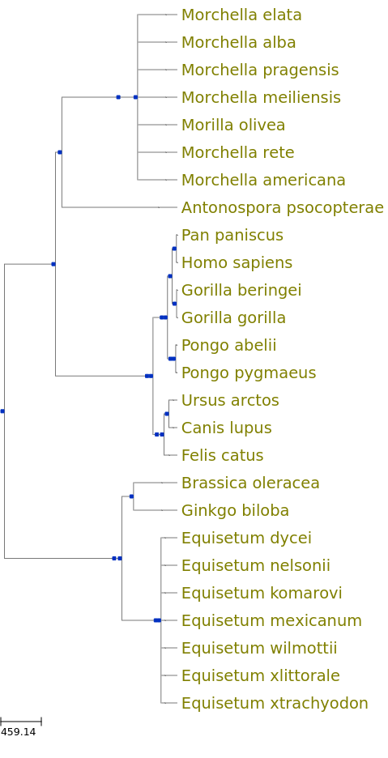
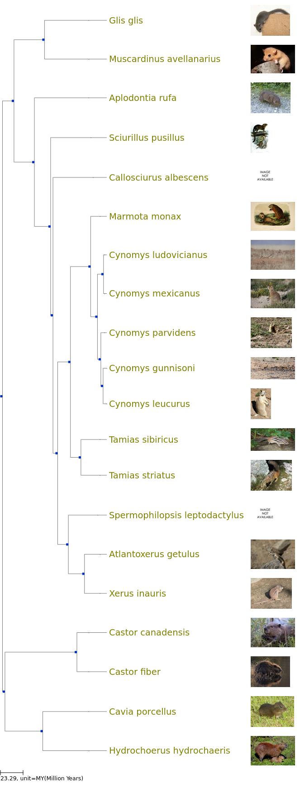
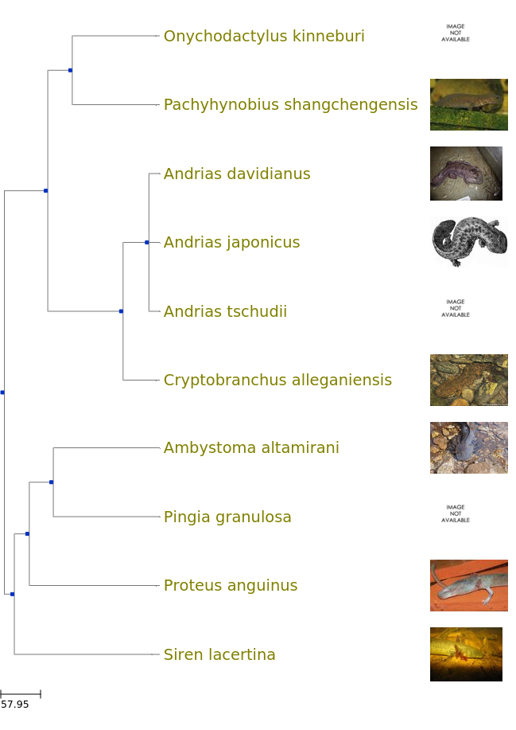
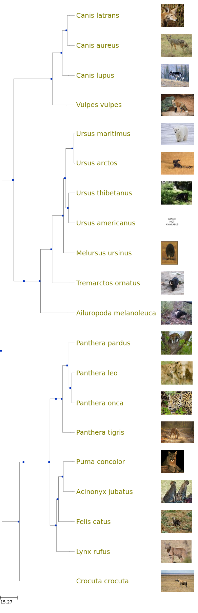
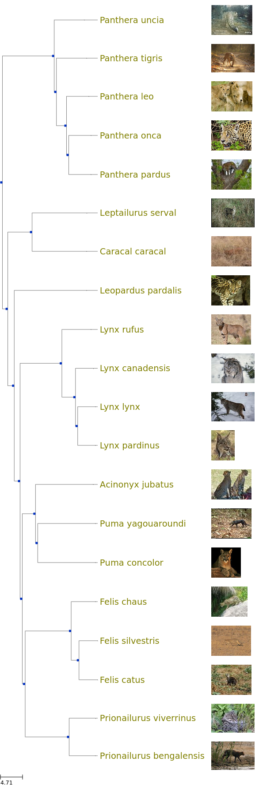
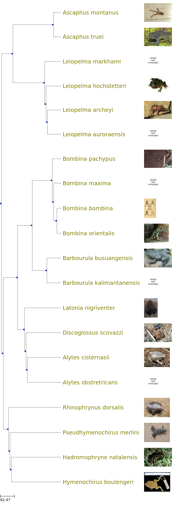

# popularity service evaluation 

## Animals, plants, and fungi

Taxa
* Plantae is Archaeplastidae in OT with id = 5268475.  This is incertae sedis.  
* Fungi is 352914.  
* Animalia is Metazoa, 691846

Pop service query
* `http://beta.onezoom.org/popularity/list?key=0&otts=5268475%2C+352914%2C+691846&expand\_taxa=True&max=25&names=True&sort=rank`

This returns top 25 mammals.  Need to separate the three.  I'll get 10 of each kingdom
* `http://beta.onezoom.org/popularity/list?key=0&otts=5268475&expand\_taxa=True&max=10&names=True&sort=rank`
* `http://beta.onezoom.org/popularity/list?key=0&otts=352914&expand\_taxa=True&max=10&names=True&sort=rank`
* `http://beta.onezoom.org/popularity/list?key=0&otts=691846&expand\_taxa=True&max=10&names=True&sort=rank`

This is what I get
* Brassica oleracea
* Ginkgo biloba
* Equisetum xtrachyodon
* Equisetum font-queri
* Equisetum nelsonii
* Equisetum mexicanum
* Equisetum wilmottii
* Equisetum xlittorale
* Equisetum dycei
* Equisetum komarovi
* Pseudaphelidium drebesii
* Morchella meiliensis
* Morchella rete
* vouchered mycorrhizae Ascomycota
* Morchella elata
* Morilla olivea
* Morchella americana
* Morchella pragensis
* Morchella alba
* Antonospora psocopterae
* Canis lupus
* Pan paniscus
* Ursus arctos
* Pan troglodytes
* Pongo pygmaeus
* Pongo abelii
* Gorilla gorilla
* Gorilla beringei
* Felis catus
* Homo sapiens

## Rodents

20 Rodents 
* there are 2 beavers
* 

##  Salamanders (Urodela)

Issues 
* there are 3 from the genus of giant salamanders 

salamanders\_10.png

## Carnivores (Carnivora)

Issues. Cats, bears and dogs.  This is expected.  Hyena is a bonus.  I was hoping to see 
* a weasel or other mustelid
* a seal or sea lion (pinnipedia)
* a skunk

## Cats (Felidae)

## Frogs (Anura)

